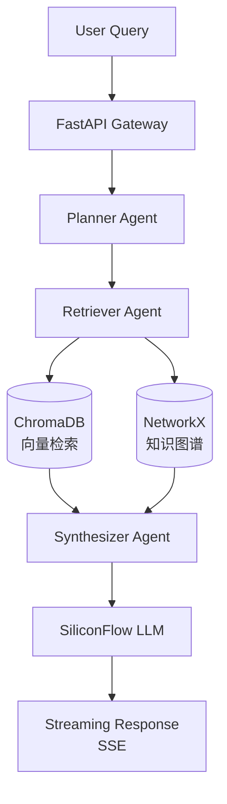


```markdown
# GraphRAG Multi-Agent 竞品分析系统

> 基于 LangGraph + FastAPI 的智能竞品情报分析 API，支持知识图谱增强检索与多 Agent 协作。

## 🚀 在线演示

- **健康检查**: http://120.26.140.131/health
- **API 文档**: http://120.26.140.131/docs (Swagger UI)
- **源码**: https://github.com/haoyuehhh/graphrag-agent

## ✨ 核心功能

- **Multi-Agent 架构**: Planner → Retriever → Synthesizer 三节点协作流水线
- **GraphRAG 混合检索**: NetworkX 知识图谱 + ChromaDB 向量数据库双路召回
- **流式响应**: Server-Sent Events (SSE) 实时返回分析过程与结果
- **熔断降级**: SiliconFlow API 故障时自动切换备用策略，保障服务可用性
- **缓存优化**: Redis 缓存高频查询，降低 LLM 调用成本

## 🏗️ 技术架构



## 🛠️ 技术栈

| 层级 | 技术 |
|------|------|
| 框架 | FastAPI, Uvicorn, Gunicorn |
| AI/ML | LangGraph (自研状态机), LangChain, OpenAI Compatible API |
| 数据库 | ChromaDB (向量), NetworkX (图谱), Redis (缓存) |
| 部署 | 阿里云 ECS, Ubuntu, Nginx, Systemd |
| 监控 | 健康检查, 限流, 熔断降级, Git 状态检查 |

## 📦 快速开始

### 本地开发

```bash
# 1. 克隆
git clone https://github.com/haoyuehhh/graphrag-agent.git
cd graphrag-agent

# 2. 环境
python -m venv venv
# Windows:
venv\Scripts\activate
# Linux/Mac:
source venv/bin/activate

pip install -r requirements-prod.txt

# 3. 配置
cp .env.example .env
# 编辑 .env: SILICONFLOW_API_KEY=sk-xxxx

# 4. 启动
uvicorn app.main:app --reload --host 0.0.0.0 --port 8000
```

### 生产部署

```bash
# 服务器部署（Ubuntu）
sudo apt update && sudo apt install -y python3-pip nginx git
git clone https://github.com/haoyuehhh/graphrag-agent.git
cd graphrag-agent
python3 -m venv venv && source venv/bin/activate
pip install -r requirements-prod.txt

# 配置 systemd + nginx
sudo cp deploy/graphrag.service /etc/systemd/system/
sudo systemctl daemon-reload
sudo systemctl enable --now graphrag
sudo systemctl status graphrag
```

## 🔌 API 端点

### 健康检查
```http
GET /health
```

```json
{
  "status": "healthy",
  "agents_ready": true,
  "version": "1.0.0"
}
```

### 竞品分析（非流式）
```http
POST /api/v1/analyze
Content-Type: application/json

{
  "query": "分析竞品A和B的技术差异",
  "streaming": false
}
```

### 竞品分析（流式）
```http
POST /api/v1/analyze/stream
Content-Type: application/json

{
  "query": "分析竞品A和B的技术差异",
  "context": {}
}
```

## 📝 项目结构

```
app/
├── api/              # API 路由层 (endpoints)
├── core/             # 配置、生命周期事件、限流器
├── graph/            # LangGraph 节点定义与状态管理
│   ├── nodes/        # Planner, Retriever, Synthesizer
│   └── state.py      # GraphState 状态定义
├── services/         # 业务逻辑层
│   ├── rag_service.py    # Hybrid RAG 检索服务
│   └── circuit_breaker.py # 熔断降级实现
└── utils/            # 工具函数与日志配置
deploy/               # 部署配置 (systemd, nginx)
scripts/              # 部署前检查脚本 (PowerShell)
```

## 🎯 面试亮点

- **架构设计**: Multi-Agent 协作解决单 Agent 上下文局限，Planner 动态分解任务，Retriever 多源召回，Synthesizer 整合输出
- **工程化**: 完整的 FastAPI 生产级结构（配置分离、结构化日志、限流中间件、 graceful shutdown）
- **稳定性**: 实现 Circuit Breaker 模式应对 LLM API 故障，Redis 缓存削峰填谷
- **部署运维**: 阿里云 ECS (2核2G) + Systemd 守护进程 + Nginx 反向代理完整链路，Swap 优化小内存运行
- **成本控制**: 模型蒸馏压缩 + 缓存策略，单机部署成本 < 100元/月

## 📄 License

MIT © 2026 haoyuehhh
```
