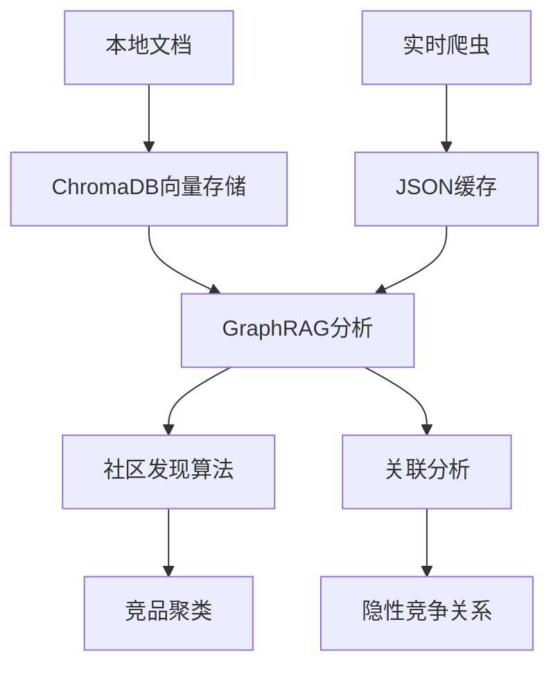

# 混合分析策略：本地文档 + 实时爬虫

## 数据采集策略：冷启动 + 热更新

### Layer 1: 本地知识库（冷启动）
- **数据来源**: 预先整理的官方文档、用户手册、第三方评测
- **存储位置**: `data/competitors/` 目录
- **数据格式**: Markdown 文档
- **用途**:
  - 功能对标分析
  - 基础技术架构分析
  - 竞品基础画像构建
- **特点**:
  - 离线可用
  - 数据稳定可靠
  - 适合深度分析

### Layer 2: 实时爬虫（热更新）
- **数据来源**: BrowserSkill 定期爬取官网
- **爬取内容**:
  - 定价页面（pricing pages）
  - 发布说明（release notes）
  - 新功能介绍
- **触发机制**:
  - 定期爬取（如每24小时）
  - 检测数据变更
  - 手动触发更新
- **用途**:
  - 价格变动监控
  - 新功能首发分析
  - 实时竞品动态跟踪

### Layer 3: GraphRAG增强（智能关联）
- **技术实现**:
  - 本地文档 → ChromaDB（向量检索）
  - 爬虫数据 → JSON缓存 → 定期同步到Graph
  - 关联分析 → NetworkX社区发现算法
- **分析能力**:
  - 竞品聚类识别（如"本地优先笔记工具"vs"云端协作工具"）
  - 隐性竞争关系发现（如Notion Calendar vs Cron）
  - 功能相似度分析

## 技术架构

## 实现细节

### 数据流
1. **本地文档加载**:
   - 从 `data/competitors/` 加载 Markdown 文件
   - 解析为竞品画像（CompetitorProfile）
   - 存储到 ChromaDB 向量数据库

2. **实时爬虫**:
   - BrowserSkill 爬取官网数据
   - 检测数据变更
   - 更新本地缓存

3. **混合分析**:
   - 优先使用本地数据
   - 数据过期时自动触发爬虫
   - GraphRAG 增强分析结果

### 版本控制
- 本地文档：纳入 Git 版本控制
- 爬虫数据：存储在 `data/crawled/`，排除在 Git 外
- 缓存策略：支持增量更新和过期检测

## 优势

1. **可靠性**: 本地文档提供稳定的基础数据
2. **实时性**: 爬虫确保数据的及时性
3. **智能性**: GraphRAG 提供深度关联分析
4. **灵活性**: 支持多种数据源和更新策略
5. **可扩展性**: 易于添加新的竞品和数据分析维度